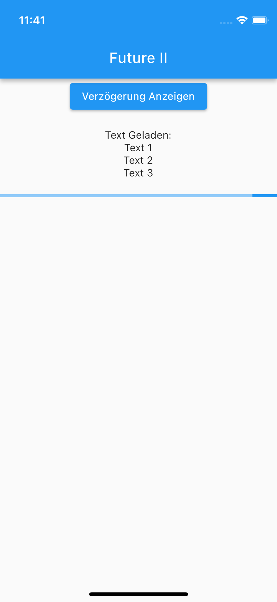

# App Akademie

Ordner für Abgaben

## Ordner Struktur

Hier kommen alle Abgaben aus den Tasksheets.

Siehe:

- [Abgaben]
<!-- - [Neuer Ordner](link zum ordner) -->

## 5.5.2 Futures II

Lösungen

<table>
  <tr>
    <td style="text-align: center;">
      
      
Future II

    </td>
    <td style="text-align: center;">
      
      
Future II

    </td>
  </tr>
    <td style="text-align: center;">
      
      
Future II

    </td>
    <td style="text-align: center;">
      
      
Future II

    </td>
  </tr>
  </table>